 
# Potluck Chef
---
  ## **Description**
  Welcome to The Potluck Chef! A place where users can come, and have a place where they can catalog their recipes, while sharing it with others at the same time. 

  At the home page, you are introduced to the list of ingredients currently on our site. From there, you can click the title of the recipe which will drop down an associated video of the recipe, the ingredients and directions to make it. So visit our [website](https://potluck-chef.herokuapp.com/index) and checkout our recipes.
  
  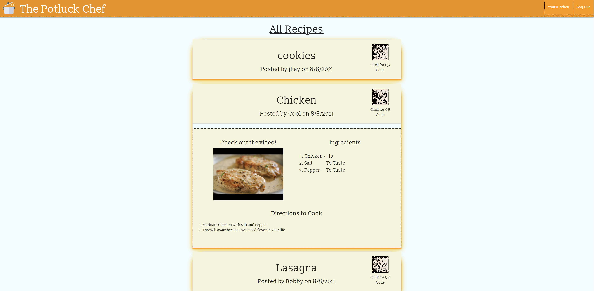

---

  # **Table Of Contents**
  * [Usage](#usage)
    * [Login](#login)
    * [Create Recipe](#create-recipe)
    * [Display Recipe](#display-recipe)
    * [Mobile Responsive](#mobile-responsive)
  * [License](#license)
  * [Credits](#credits)
  * [Questions](#questions)

---

# **Usage**
### To use Potluck Chef, just go to [The Potluck Chef](https://potluck-chef.herokuapp.com/index)

---
## Login
---

  In order to create a recipe on the site, you are required to log in, to start navigate to the login button on the top right if you're on desktop. 

   

  On mobile use the menu button on the top left to navigate to the login page. 

  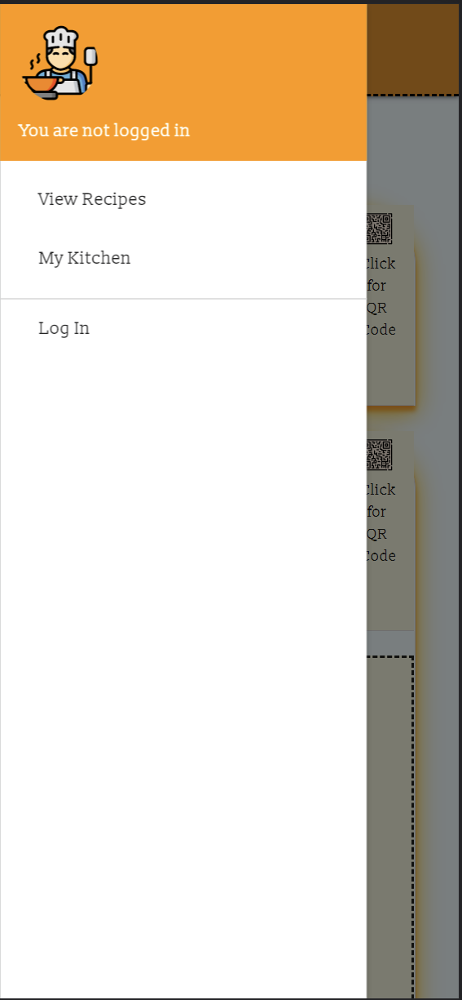

  The login page is a place where you can also sign up if you plan on adding your own recipes.

  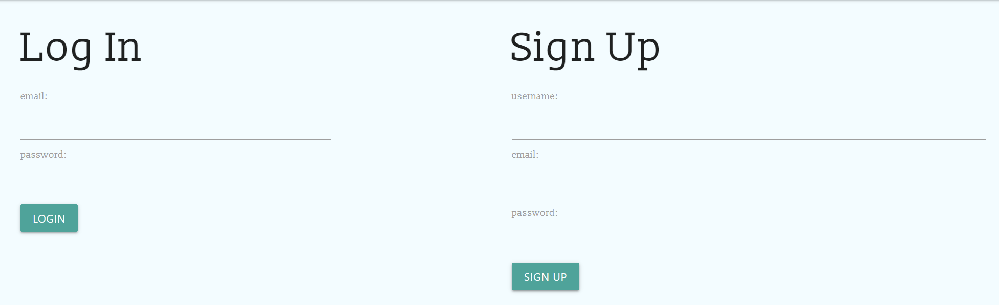

  After logging in, you are met with your kitchen, where you can concoct new recipes, or share old ones. 

  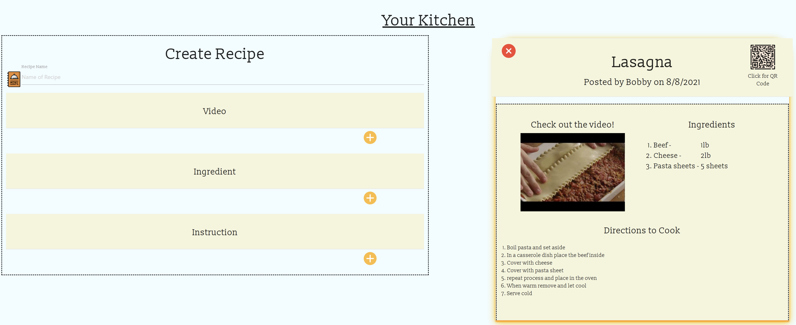

---
## Create Recipe
---
  The create a recipe, start by entering the name of the recipe, followed by selecting an associated video. The video are sourced from the top 12 search results. 

  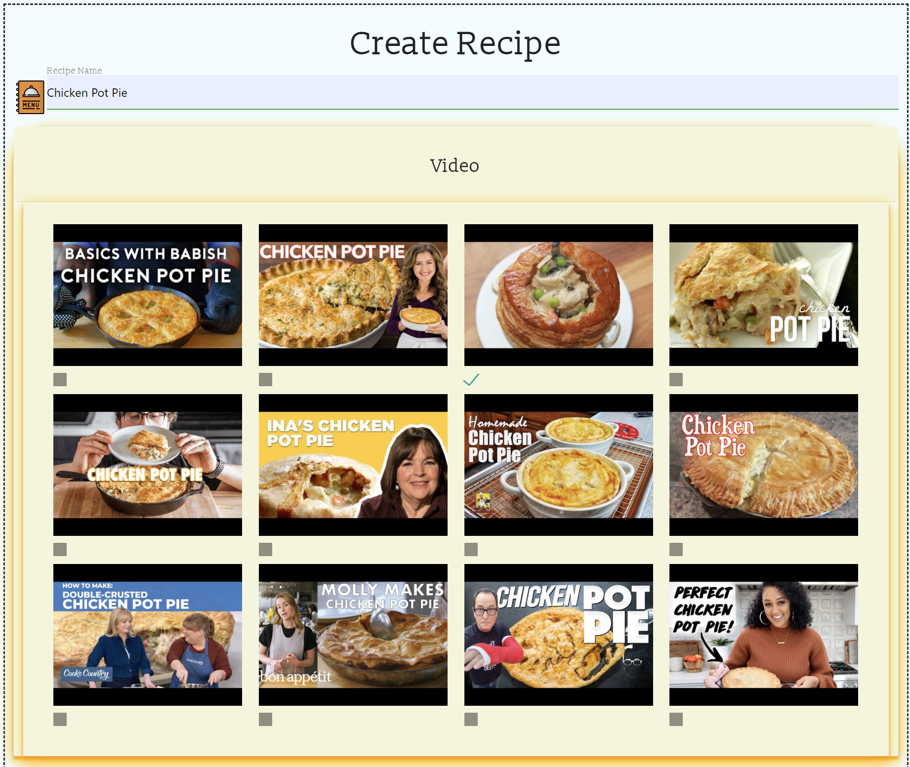

  Once you select a video, you can collapse the video section, and write to enter the ingredients and amount. By pressing the plus sign, you can keep adding new ingredients to the recipe. 

  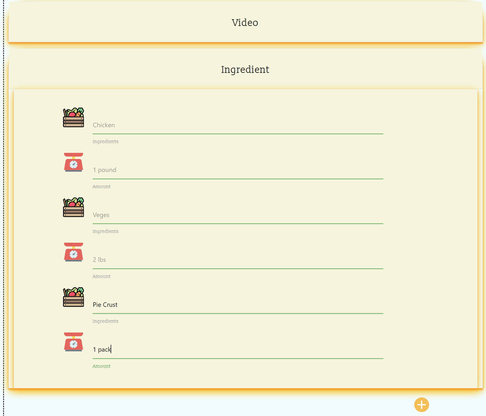

  Now to add the steps to create the recipe. You can collapse your ingredients and start to enter in the steps to make your recipe. Pressing the plus sign allows you to add more steps. Once your steps and ingredients are complete, hit the cookbook at the bottom to add it onto the website

  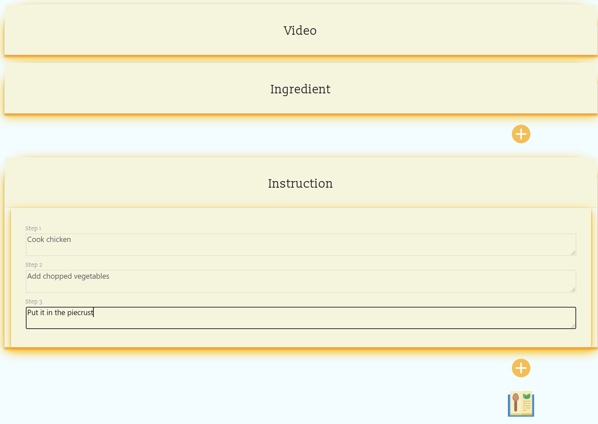

---
## Display Recipe
---
  After you submit the recipe, it will appear on the right side. It will automatically generate a QR code of the link of the video to reference the recipe you selected.

  
  
  If you are unhappy with your recipe, you can delete it using the red X on the top left of your recipe while you are on the dashboard. 

  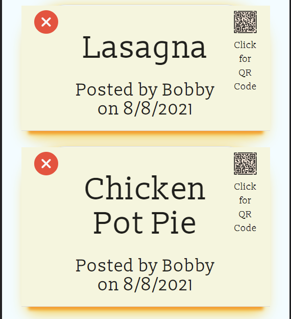

  Navigating to the homepage, you will see your recipe has been shared with everyone who visits the site. They can also reference the website using the QR code by selecting it.

  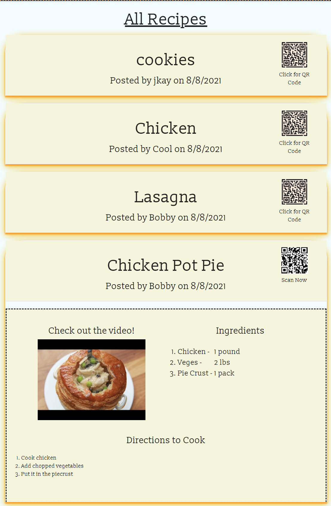

---
## Mobile Responsive
---
  Everyone will get a chance to view your recipe wherever they are! With our responsive design, users will enjoy the steps it took to make the best lasagna, wherever they may be! 

  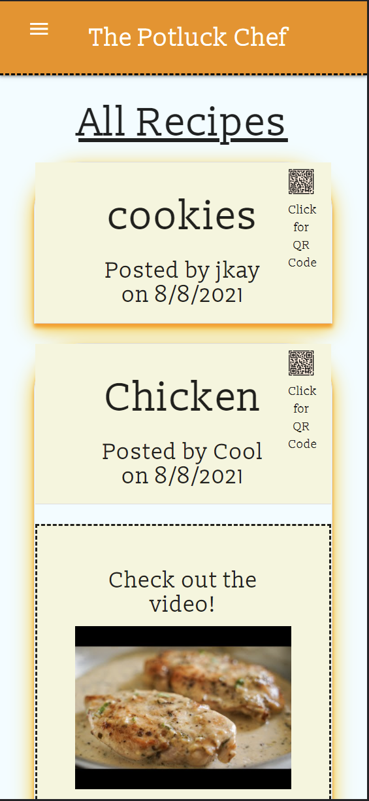
  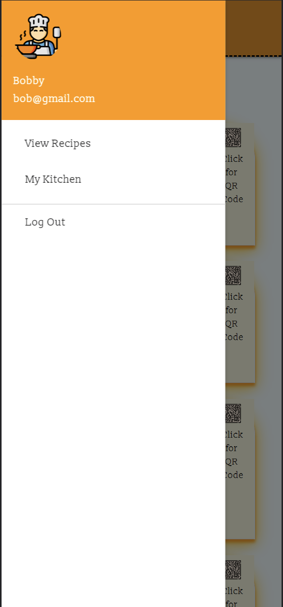
  
  

###  **Leave your best recipes here, at Potluck Chef!**

---

# **License**

- [MIT](https://choosealicense.com/licenses/mit/)

---   
# **Credits**

  1. Hamzah Ullah - [Github](https://github.com/brobro10000), [Profile](https://brobro10000.github.io/) 
  2. Ashley Thomas - [Github](https://github.com/AshleyTh) 
  3. Kerby Henry - [Github](https://github.com/kerbyoboy) 
  4. Mitchell Pullin - [Github](https://github.com/mtpullin)
---
# **Website**

## https://potluck-chef.herokuapp.com/index
  
---

# **Questions**

  If you have any questions please email at
    mtpullin@gmail.com
  
  Visit my github profile for more of my work.
    <a href="https://github.com/mtpullin">Github Page</a>

---